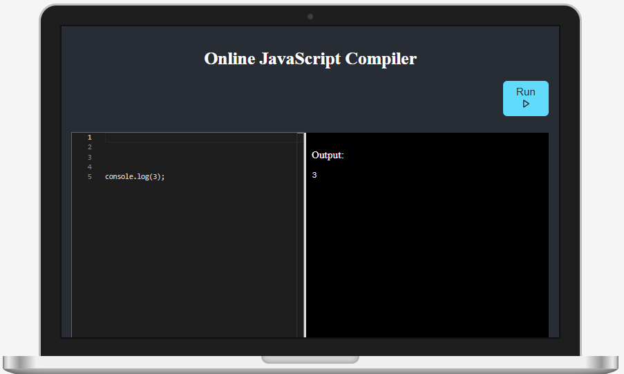

# **React + Vite Online JavaScript Compiler**

  

---

### 🌟 **Live Demo**

🔗 **[Click here to try the Compiler](https://manavonlinecompiler.netlify.app)**

---

## 🖥️ **About the Project**

This is a powerful **Online JavaScript Compiler** built with **React** and **Vite**.  
It offers users an interactive platform to write, edit, and execute JavaScript code in real time.

---

## ✨ **Key Features**

✅ **Real-Time Code Editor**: Powered by [Monaco Editor](https://github.com/microsoft/monaco-editor) for a seamless coding experience.  
✅ **Resizable Layout**: Easily adjust the editor size to suit your needs.  
✅ **Instant Execution**: Execute code and view the output immediately.  
✅ **Sleek Design**: Includes a **MacBook-styled frame** for an enhanced look and feel.  
✅ **Backend API**: A secure Node.js API handles code execution.

---

## 🛠️ **Tech Stack**

**Frontend**: React, Vite, Monaco Editor, React Icons  
**Backend**: Node.js, Express  
**Deployment**:

- **Frontend**: Netlify
- **Backend**: Render

---

## 📸 **Screenshots**

  

---

## 🛡️ **Getting Started**

1. Visit the live link: **[Manav's Online Compiler](https://manavonlinecompiler.netlify.app)**.
2. Write your JavaScript code in the editor.
3. Press the **Run** button to execute.
4. View the results in the output panel.

---

## 🚀 **Future Plans**

🔹 Add support for multiple programming languages.  
🔹 Introduce a dark mode toggle for accessibility.  
🔹 Enable users to save and share code snippets.  
🔹 Include linting and formatting options.

---

### 👤 **About the Developer**

Created with ❤️ by **Manav**.  
Feel free to connect or provide feedback to help improve the project!

---

Let me know if you want additional visual styling or more elements! 🚀
